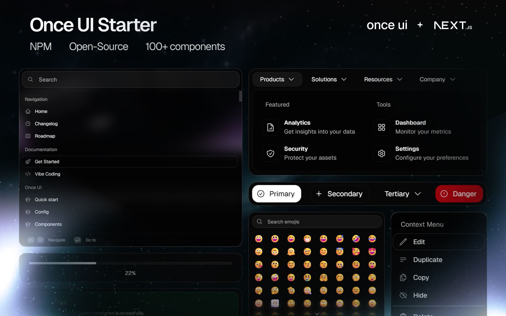

# Neelansh Khare - Portfolio Website

A personal portfolio and blog built with Next.js 14, TypeScript, Tailwind CSS, and Three.js. Statically exported and deployed to GitHub Pages.



## Features

### Portfolio (`/`)
- **Spline 3D hero card** with spotlight effect (lazy-loaded, client-only)
- **Three.js shader animation** section
- Sections: About, Experience, Education, Projects, Skills, Contact
- Bottom-bar "tubelight" navigation with scroll-spy on desktop and mobile
- Direct link into the blog from the navigation

### Blog (`/blog`)
- Post index at `/blog` (summaries with "Read more →")
- Per-post pages at `/blog/[slug]` with `generateStaticParams` and per-post `generateMetadata`
- ISO dates rendered via `<time dateTime="...">` and formatted at render
- Posts are automatically sorted newest-first at render time
- Auto-generated `sitemap.xml` and `rss.xml`

### Technical
- **Responsive** mobile-first design
- **Accessibility**: semantic HTML, machine-readable dates, `aria-*` where relevant
- **Performance**: `next/dynamic` for heavy 3D content, `prefers-reduced-motion` respected
- **Type-safe**: full TypeScript with typed portfolio and blog data
- **Static export** compatible with GitHub Pages (`output: 'export'`, `basePath: '/new-portfolio'`)

## Tech Stack

- **Framework**: Next.js 14.2 (App Router, static export)
- **Language**: TypeScript 5.8
- **UI**: React 18, Tailwind CSS 3, shadcn/ui-style primitives, Once UI Core
- **3D**: `@splinetool/react-spline`, `three`
- **Icons**: `lucide-react`, `react-icons`

## Getting Started

### Prerequisites
- Node.js 18+ (CI uses Node 20)
- npm

### Install & run

```bash
npm ci
npm run dev
```

Open <http://localhost:3000/new-portfolio> in your browser.

> Note: because `basePath` is set to `/new-portfolio` in `next.config.mjs`, the app is served under that prefix locally too. Visiting `/` will 404 in dev; visit `/new-portfolio` instead.

### Available scripts

- `npm run dev` — start dev server
- `npm run build` — build for production (produces static `out/`)
- `npm run start` — serve the production build
- `npm run lint` — run ESLint
- `npm run typecheck` — run `tsc --noEmit`
- `npm run biome-write` — format with Biome

## Project structure

```
src/
├── app/
│   ├── (main)/                # Portfolio route group (own <html>/<body>)
│   │   ├── layout.tsx
│   │   └── page.tsx
│   ├── (blog)/                # Blog route group (own <html>/<body>)
│   │   ├── layout.tsx
│   │   └── blog/
│   │       ├── page.tsx       # Blog index
│   │       └── [slug]/
│   │           └── page.tsx   # Individual post
│   ├── api/og/                # OG image proxy/fetch route handlers
│   ├── rss.xml/route.ts       # Static RSS feed
│   ├── sitemap.ts             # Static sitemap
│   ├── globals.css
│   └── favicon.ico
├── components/
│   ├── Navigation.tsx
│   ├── Providers.tsx
│   ├── sections/              # Portfolio sections
│   └── ui/                    # Reusable primitives
├── data/
│   ├── portfolio.ts           # Typed portfolio content
│   └── blog.ts                # Typed blog posts (ISO dates)
├── lib/
│   ├── blog.ts                # Sorting/lookup helpers
│   └── utils.ts
├── resources/                 # Once UI config, fonts, icons
└── types/
```

## Customization

### Portfolio content
Edit `src/data/portfolio.ts`.

### Blog content
See [`docs/blog-updates.md`](docs/blog-updates.md).

### Spline scene
Update the URL in `src/components/sections/SplineHero.tsx`:

```tsx
<SplineScene
  scene="YOUR_SPLINE_SCENE_URL"
  className="w-full h-full"
/>
```

### Styling
- Global styles: `src/app/globals.css`
- Tailwind config: `tailwind.config.ts`
- Once UI config: `src/resources/once-ui.config.js`

## Deployment

This repository is configured to deploy to **GitHub Pages** via `.github/workflows/deploy.yml`. The workflow runs on every push to `main`:

1. Installs dependencies (`npm ci`)
2. Runs `npm run lint` and `npm run typecheck`
3. Runs `next build` (which produces `out/` because `output: 'export'`)
4. Uploads `out/` as the Pages artifact
5. Deploys to Pages

Because the site is served from `https://<user>.github.io/new-portfolio/`, `next.config.mjs` sets `basePath: '/new-portfolio'` and `images.unoptimized: true`. All internal navigation must go through `next/link` or `next/image` so the base path is prefixed automatically.

## License

MIT — see [`LICENSE`](LICENSE).
